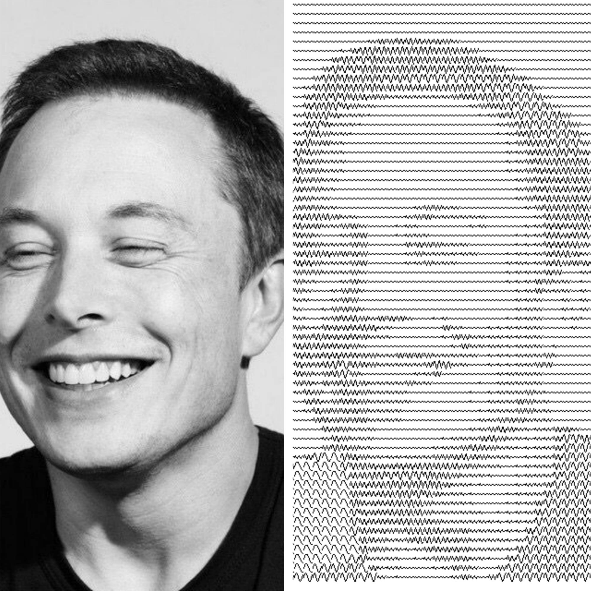

# wave art
Generate wave art for an image.

### Requirements:
- OpenCV `pip install opencv-python`
- Numpy `pip install numpy`

#### Usage

```python
python main.py [-h] --image_path IMAGE_PATH [--patch_size PATCH_SIZE]
```

#### Example Usage

```python
python main.py --image_path elon.jpg --patch_size 10
```

#### Output:



#### Info:

*The `patch_size` may be changed to obtain better results. Generally, values of 10, 15 or 20 work better.*

**give me ⭐ if you like my project!**
